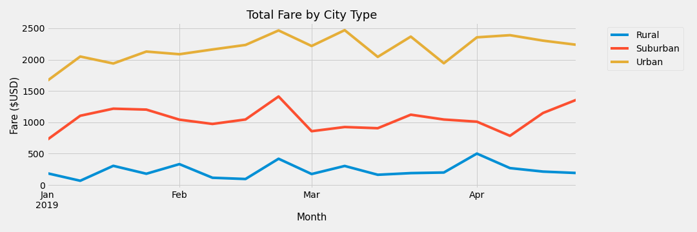
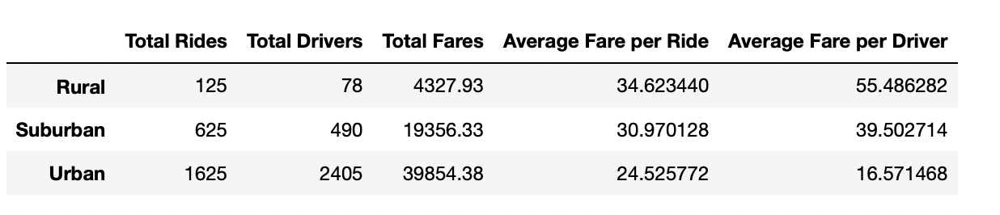

# PyBer Analysis

## Overview

The goal of this challenge is to provide ridesharing data visualizations for PyBer in order to promote access to ride-sharing services and determine affordability for underprivileged neighborhoods.

The study is based on data obtained in the form of a CSV file from PyBer. This data has been processed using Python's Pandas to produce a summary dataframe (shown below) as well as a chart generated using the information in the dataframe to visualize the data.

## Results

### 1. Total Fare by City Type

The figure below shows the total fares for each city type between January to April (2019):

From this chart, the quantity of money made by the service is fairly steady over this time period. Urban cities generate the most total revenue, followed by suburban and rural locations. The ratio of total fares between urban and suburban cities is around `2:1`, while the ratio of total fares between urban and rural cities is about `9:1`.

The observed outcome is not surprising since urban cities are expected to generate more revenue. They have more population than suburban or rural locations.

### 2. Summary Dataframe by City Type

The figure below indicate the total number of rides, total number of drivers, total fares for each city type, average fare per ride, and average fare per driver for each city type. 

There is a huge gap in the number of rides in urban and suburban cities, which is about 2.6:1. For urban and rural cities, this ratio is about 13:1. Furthermore, the number of drivers in urban areas is about five times than that of suburban cities, and 31 times than that of rural cities. The number of total fares in urban cites is approxiamte 2 times higher than suburban cities, and 9 times higher than rural cities.

The "Average Fare per Ride" is calculated by "Total Fares" divided by "Total Rides". Rural cities have the highest average fare per ride, which is $34.62. Average fare per ride for suburban cities is 90% of this number, while average fare per ride for urban cities is 70% of this number, 

The difference between "Average Fare per Driver" is even larger because the difference between "Total Drivers" is huge. The highest average fare per driver is in the rural cities ($55.49). The lowest average fare per driver is in the urben cities ($16.57).

### 3. Summary

In conclusion:

- Urban cities generatet the highest fares for PyBer
- Customers in urban cities pay less per ride and therefore drivers earn less per ride
- Drivers in rural cities get the highest average fare($55.49), which is about 3.35 times higher than drivers in urban cities.

In order to reduce the disparity between Urban, Suburban and Rural cities, we recomend the following:

1. This study only focused on the first 4 months of a year. There might be difference trends between seasons. In order to further study the yearly trends, we shoud analyze the data for the whole year.
2. From the "Summary Dataframe by City Type", the total number of drivers in rural areas is not enough. More driver in rural areas should be hired.
3. The  "Average Fare per Driver" for urben cities is very low. Decreasing the total drivers in urben cities might increase the amount of fares for each driver.

